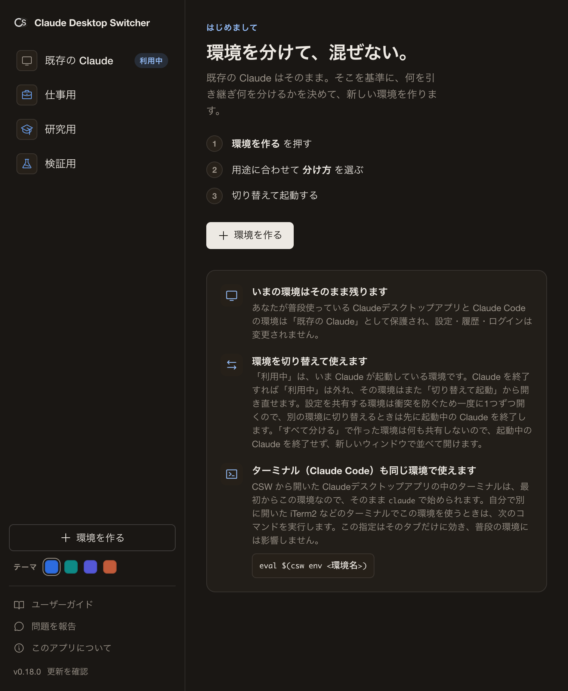
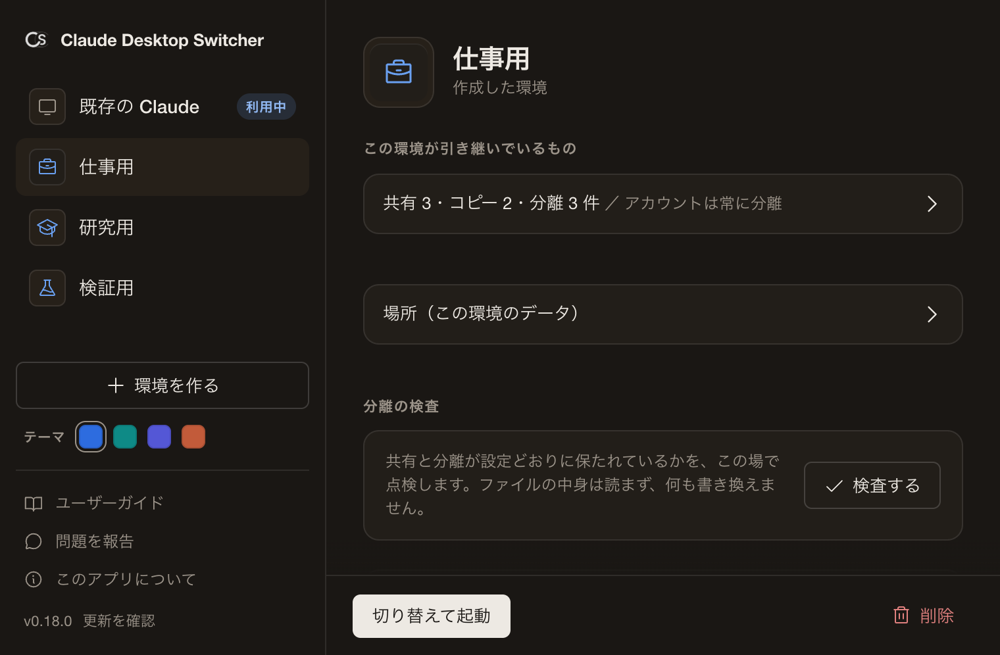
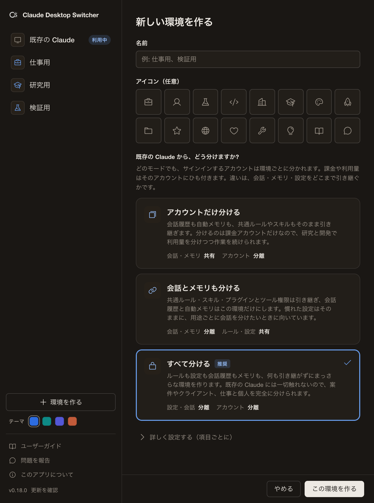

# Claude Desktop Switcher: ユーザーガイド

Claude Desktop Switcherは、ClaudeデスクトップアプリとClaude Code（CLI）の環境を、アカウント単位で安全に分離・管理するためのmacOSメニューバーユーティリティです。

### なぜこのツールが必要なのか？（既存のワークアラウンドとの違い）
公式のClaudeデスクトップアプリには複数アカウントを切り替える機能がありません。そのため、多くのユーザーはターミナルから `--user-data-dir` を指定して別インスタンスを強引に起動したり、CLI専用のスイッチャー（`direnv` やエイリアス等）を使って凌いできました。
しかし、これらの方法では「デスクトップアプリの安全な分離（環境ごとの専用データディレクトリ）」と「CLI 環境の連動」を両立することはできません。

本ツールは、これらの一連のハックや複雑なシェルスクリプトを不要にし、設定ウインドウから**「デスクトップアプリの分離」**をワンクリックで行えます。さらに、ターミナルからコマンドを実行することで**「デスクトップアプリと連動したCLI環境の起動」**も実現。システムの環境変数を一切破壊しない「ゼロ・インパクト原則」に基づいて設計されています。

---

## 0. 考え方：「既存の Claude」を基準に分ける

CSW はこの一点だけ理解すれば迷いません。

- **「既存の Claude」= あなたの既存環境**（普段使っている Claudeデスクトップアプリと Claude Code）。これが基準点で、CSW はここを一切変更しません。
- **新しい環境を作る = 「既存の Claude」から、何を引き継ぎ・何を分けるかを決めること。** 共有・分離・コピーの「相手」は常に「既存の Claude」です。
  - **共有**: 既存の Claude と同じ実体を使う（変更は両方に反映）
  - **分離**: この環境専用の新しい実体を持つ（独立・最初は空）
  - **コピー**: 作成時に一度だけ写し、以後は独立
- **同じアカウントを使い続けたいだけなら、新しい環境は不要です。** その場合は「既存の Claude」をそのまま使えばよく、CSW を起動する必要すらありません。CSW が活きるのは「**別アカウント／別案件の独立環境**」を作りたいときです。
- **どの環境もアカウントは分かれます。** 各環境はそれぞれのアカウントでサインインし、課金と利用量はそのアカウントにひも付きます。サインイン情報やデバイスの識別子、コネクタを含むデスクトップアプリの設定は、どのモードでも環境ごとに分かれます。環境ごとに変わるのは「会話履歴と自動メモリを引き継ぐか」「共通ルールやスキルなどの設定を引き継ぐか」です。

---

## 1. インストールと初期セットアップ

既存のClaude環境（デフォルトの個人環境など）はそのまま維持されます。

### ステップ 1: アプリケーションのインストール
1. GitHub の [Releases ページ](https://github.com/matsumotory/claude-desktop-switcher/releases/latest) から最新の `.dmg` ファイルをダウンロードします。
2. ダウンロードした `Claude-Desktop-Switcher.app` を、macOSの「アプリケーション」フォルダにドラッグ＆ドロップします。
3. アプリを起動すると設定ウインドウが開きます。あわせて画面右上のメニューバーにアイコンが表示されます（メニューバーが混み合っていると隠れることがありますが、Dock アイコンからいつでも設定ウインドウを開けます）。インストールに使ったディスクイメージがマウントされたままの場合は、設定ウインドウの上部に案内が表示されるので、「取り出す」を押すとそのまま取り出せます。
4. 初回起動時のみ、ようこそ画面の下に補足カードが表示されます（既存の Claude が保護されること、環境を切り替えて使えること、ターミナル（Claude Code）も同じ環境で使えること）。一度表示すれば以後は出ません。

### ステップ 2: 新しい環境の作成とカスタマイズ
仕事用や研究用の新しい独立環境を作成します。

**本アプリは、データが混ざる事故を防ぐため「すべてが分離される完全隔離」がデフォルト動作となっています。**

一方で、「個人で育てた共通ルールやスキル・プラグインをそのまま使い回しつつ、利用量だけは仕事用アカウントに計上したい」といった高度なユースケース向けに、柔軟なカスタマイズ機能を提供しています。

1. 起動時に自動で開く設定ウインドウを使います（閉じているときは Dock アイコン、またはメニューバーのアイコンの **「設定...」** から再表示できます）。
2. **「環境を作る」**ボタンをクリックします。
3. 環境の情報を入力します。
   * **名前**: （例：`Work`, `Research` など）
   * **アイコン（任意）**: 用意したアイコンから選びます
4. **どう分けますか?（3つのモードから選ぶ）**
   初見でも迷わないよう、基本は次の3択です。どのモードでもアカウントは分かれ、変わるのは「何を引き継ぐか」です。引き継ぐものが多い順に並んでいます。細かく変えたい場合だけ **「詳しく設定する（項目ごとに）」** を開きます。

   * **アカウントだけ分ける**: 会話履歴も自動メモリも引き継ぎ、分離するのはアカウントだけです。研究と開発で決済を分けつつ、ひとつながりの作業を続けたいときに選びます。
   * **会話とメモリも分ける**: 共通ルール・スキル・プラグインとツール権限は引き継ぎ、会話履歴と自動メモリはこの環境だけにします。用途で分けつつ、慣れた設定を使い回したいときに選びます。
   * **すべて分ける（推奨・既定）**: 何も引き継がず完全に独立します。既存の Claude には一切触れません。案件やクライアントごと、仕事用と個人用など、混ざってはいけないときに選びます。

   「会話とメモリも分ける」と「アカウントだけ分ける」の違いは、会話履歴と自動メモリを引き継ぐかどうかの一点です。

   > 既存の Claude が標準の場所に見つからない場合（例: Claude Code の設定を `CLAUDE_CONFIG_DIR` で別の場所へ移しているとき）、引き継ぐモードでも見つからない側の設定は引き継がれません。デスクトップ・CLI の両方とも見つからないときは、引き継げる設定が無いため「すべて分ける」だけで作成できます。いずれの場合も作成画面に説明が表示されます。

   **＜ユースケースに合わせた選び方＞**
   * **ケースA（完全に別のプロジェクトとして作業する場合）**:
     **「すべて分ける」** を選びます。個人用とは切り離された、まっさらな環境が構築されます。
   * **ケースB（慣れた共通ルールやスキルを持ち込みつつ、会話とメモリは新しく始める場合）**:
     **「会話とメモリも分ける」** を選ぶと、共通ルール（CLAUDE.md）・スキル・プラグイン・ツール権限をそのまま引き継ぎつつ、会話履歴と自動メモリはこの環境だけになります。
   * **ケースC（研究と開発で決済を分けつつ、作業はそのまま続けたい場合）**:
     **「アカウントだけ分ける」** を選ぶと、会話履歴も自動メモリも引き継ぎ、分離するのはアカウントだけです。

5. **「この環境を作る」** を押して保存します。

> **既存の環境の複製**
> 設定ウインドウで環境を選び **「複製」** ボタンを押すと、共有設定と環境の構成を引き継いだ新しい環境を作成できます。似た構成をゼロから作り直す手間を省けます。アカウントのサインイン情報（config.json）は常に環境ごとに分かれるため、新しい環境ではサインインが必要です。

---

## 2. 日々の使い方（ワークフロー）

セットアップ完了後の、日常的な利用手順です。手作業での難しい設定などは一切不要です。

### シナリオ A: 仕事用アカウント（Work）で作業を始める
1. これから開くのが設定を共有する環境で、別の Claude デスクトップアプリが起動中の場合は、先にそれを終了します（衝突を防ぐため、共有を含む環境は一度に1つずつ開きます）。「すべて分ける」で作った環境なら、終了せずに新しいウィンドウで開けます。
2. 設定ウインドウで、作成した「Work」環境を選びます（設定ウインドウはメニューバーのアイコンや Dock アイコンからも開けます）。
3. **「切り替えて起動」を押すと、その環境専用の Claudeデスクトップアプリが立ち上がります。**
   （このウインドウは、完全に独立した専用のデータ領域を持っています。初回のみ、仕事用のアカウントでサインインしてください）

> **メモ: 環境の同時起動**
> 設定を共有する環境（「会話とメモリも分ける」「アカウントだけ分ける」）は、設定の衝突を防ぐため一度に1つずつ開きます。個人用に戻すときは、起動中の Claude を終了し、サイドバーの「既存の Claude」を選んで「既存の Claude に切り替える」を押してから、いつもどおり Claude を起動してください。一方、「すべて分ける」で作った環境は何も共有しないため、起動中の Claude を終了せずに、詳細画面の「重複して起動」で同時に開けます。

### シナリオ B: ターミナル（Claude Code）を使う（エンジニア向け）
ターミナルには 2 種類あり、必要な操作が違います。いずれの場合も、その環境で初めて Claude Code を使うときは、一度だけ CLI のサインインが必要です（後述の「初回だけ: Claude Code のサインイン」を参照）。

**1. CSW から開いた Claudeデスクトップアプリの中のターミナル（内蔵）**
このアプリから環境を切り替えて起動した場合、その中で開くターミナルは最初からその環境になっています。環境変数を切り替える追加のコマンドは不要で、そのまま `claude` と入力して作業を始められます。

**2. 別に開くターミナル（外部・iTerm2 や標準の Terminal）**
ご自身で新しく開いたターミナルは、普段の環境のままです。対象の環境を使うときは、連携コマンドを実行します。

このコマンドには CLI ツール `csw` が必要です。署名・公証済みの `csw` を[最新リリース](https://github.com/matsumotory/claude-desktop-switcher/releases/latest)からダウンロードし、実行権を付けて `PATH` の通った場所に置いてください（`chmod +x csw && mv csw /usr/local/bin/`）。Rust の開発環境があれば `cargo install --path crates/cli` でも導入できます。デスクトップアプリだけで使う場合は不要です。

1. ターミナル（iTerm2 や標準の Terminal）を開きます。
2. `eval $(csw env Work)` を実行します（`Work` の部分は対象の環境名）。
3. そのタブの環境変数が対象の環境に切り替わります。この指定はそのタブだけに効き、普段の環境には影響しません。そのまま `claude` で作業を始めてください。

**初回だけ: Claude Code のサインイン**
Claude Code（CLI）のサインインは、デスクトップアプリのサインインとは別に管理され、環境ごとに一度だけ必要です。上のどちらのターミナルでも、その環境でまだサインインしていない状態で `claude` を実行すると、自動でサインインを促されます。画面の案内に従い、サインイン方法の選択肢からサブスクリプションのアカウント（Claude アカウント）を選んでください。API 課金のアカウントとは別です。一度サインインすればその環境に保持されるため、次回以降や環境を切り替えたときに再サインインする必要はありません。内蔵ターミナルと、同じ環境に切り替えた外部ターミナルは、同じサインインを共有します。

### シナリオ C: いつも通り（個人用）の環境に戻る
* **デスクトップ**: 設定ウインドウ（またはメニューバーのアイコン）から「既存の Claude」を選択するか、Mac の Spotlight 等から `Claude.app` を直接起動すれば、常にこれまで通りの個人用の環境が開きます。
* **CLI**: ご自身で普通に開いたターミナル（iTerm2など）で `claude` と打てば、常に既存の Claude（個人用）の環境として動作します。

---

## 3. 知っておくべきこと（安心・安全の仕様）

* **アプリを起動し忘れても安全です（ゼロ・インパクト）**
  Claude Desktop Switcherは、システムの環境変数を裏で勝手に書き換えることはありません。本アプリを使わずに普通にClaudeを起動した場合は、100%これまで通り、既存の Claude として動くため、環境が破壊されることはありません。
* **間違ったアカウントでの利用を防ぐ見分け方**
  「今、自分がどっちのアカウントでターミナルを叩いているか」迷った場合は、必ず `csw status` コマンドを実行してください。現在のアクティブな環境名が安全に確認できます。
* **アクセントカラーを選べます**
  サイドバー下部のスウォッチで、アクセントカラーをブルー（既定）・ティール・インディゴ・テラコッタの4色から選べます。選んだ色は保存され、次回も同じ配色で開きます（共有・分離・削除などの意味色は変わりません）。
* **ヘルプとバージョン**
  サイドバー最下部から、ユーザーガイド・問題の報告（GitHub）・このアプリについて（免責）を開けます。現在のバージョンと「更新を確認」（最新リリースの確認）も同じ場所にあります。外部リンクは既定のブラウザで開き、アプリ自体はインターネット通信を行いません。
* **何を読み書きするかを文書ですべて公開しています**
  このアプリが読む場所・書く場所・決して触れないものの一覧と、通信していないことをご自身の Mac で確かめる手順を、[プライバシーと透明性](PRIVACY.md)にまとめています。宣言だけでなく、確かめ方まで含めて公開しています。
* **分離が保たれているかをいつでも点検できます**
  環境の詳細画面の「分離の検査」で「検査する」を押すと、共有と分離が設定どおりかを項目ごとに確認できます。検査はファイルの中身を読まず、何も書き換えません。ターミナルでは `csw doctor` で同じ検査ができ、`csw doctor --fix` はリンク先が想定と異なってしまった共有リンクの張り直しだけを行います。名前の似た Claude Code 本体の `claude doctor` はインストールを診断する別のコマンドで、この検査とは関係ありません。

---

## 4. よくある質問（FAQ）

**Q. 「共有」「分離」は、何に対しての共有・分離ですか？**
常に「既存の Claude」（あなたの既存環境）に対してです。新しい環境の各項目を、既存の Claude と同じものを使う（共有）か、この環境専用に新しく持つ（分離）かを選びます。

**Q. 「既存の Claude」とは何ですか？**
あなたが普段使っている既存の Claudeデスクトップアプリと Claude Code の環境そのものです。CSW はこれを表示・基準にするだけで、設定・会話履歴・アカウントを変更したり削除したりしません。アプリ内では環境一覧の先頭に「既存の Claude」として並びます。

**Q. 同じアカウントを使うだけでも、新しい環境を作る必要がありますか？**
いいえ。同じアカウント・同じ環境を使い続けたいだけなら、新しい環境は不要です。いつもどおり Claude を起動すれば「既存の Claude」がそのまま使われます。CSW が役立つのは、別アカウントや別案件のために独立した環境を増やしたいときです。

**Q. 新しい環境を作ると、既存の Claude は壊れませんか？**
壊れません。新しい環境は専用ディレクトリに作られ、元の環境とは物理的に分かれています。環境を削除しても、既存の Claude には影響しません。

**Q. 切り替えるたびに再サインインが必要ですか？**
いいえ。各環境はアカウントのサインイン情報を自分のディレクトリ内に保持します。初回だけサインインすれば、以後は切り替えてもサインインは保たれます（アカウントは常に環境ごとに分かれるので、新しい環境を作った直後はその環境で一度サインインします）。

**Q. デスクトップアプリを切り替えると、ターミナル（Claude Code）も自動で揃いますか？**
CSW から開いたアプリの中のターミナルは、最初からそのアプリと同じ環境なので、コマンドは要りません。ご自身で別に開いたターミナルは普段の環境のままなので、対象の環境名を渡して `eval $(csw env Work)` を実行して明示的に揃えてください。この指定はそのタブだけに効き、普段の環境には影響しません。環境の設定ディレクトリは自動で揃いますが、その環境で初めて Claude Code を使うときは、CLI のサインインが別途一度だけ必要です。詳しくは次の Q を参照してください。

**Q. デスクトップアプリにサインインしていれば、ターミナル（Claude Code）もサインイン済みですか？**
いいえ。デスクトップアプリのサインインと Claude Code（CLI）のサインインは、別々に管理されます。各環境でターミナルから初めて `claude` を使うときに、その環境で一度だけ CLI のサインインが必要です（サインイン方法はサブスクリプションのアカウントを選びます）。一度サインインすればその環境に保持され、以後は環境を切り替えても再サインインは不要です。内蔵ターミナルと、同じ環境に切り替えた外部ターミナルは、同じサインインを共有します。詳しくは「2. 日々の使い方」のシナリオ B を参照してください。

**Q. 各環境の利用量（レート制限の使用率）を CSW で一覧できますか？**
現時点では対応していません。CSW はインターネット通信を行わず、パスワードやサインイン情報にも触れない設計です。デスクトップアプリの利用分まで含めた正確な使用率を、この原則を守ったまま取得する方法が今のところ無いため、機能としては提供していません（将来、安全に取得できる公式の手段が用意されれば対応を検討します）。各環境の利用量は、その環境で Claude を開けば Claude 本体の画面で確認できます。

**Q. 「会話とメモリも分ける」を選ぶと、具体的に何を引き継ぎますか？**
共通ルール（CLAUDE.md）・スキル（skills/）・プラグイン（plugins/）・ツール権限とフック（settings.json）を、既存の Claude から引き継ぎます。一方で、プロジェクトの会話・メモリ（projects/）と入力履歴（history.jsonl）は、この環境だけにします。アカウントのサインイン情報（config.json）・コネクタとアプリ設定（claude_desktop_config.json）・セッションの実行状態（sessions/）は、常に環境ごとに分かれます。細かく変えたい場合は作成画面の「詳しく設定する（項目ごとに）」で個別に調整できます。

**Q. 「アカウントだけ分ける」を選ぶと、何が変わりますか？**
共通ルール・スキル・プラグイン・ツール権限に加えて、プロジェクトの会話・メモリ（projects/）と入力履歴（history.jsonl）も引き継ぎます。分離するのはアカウント（サインイン情報 config.json、課金・利用量がひも付く先）だけです。研究と開発で決済を分けつつ、ひとつながりの作業を続けたいときに向きます。なお、コネクタとアプリ設定・セッションの実行状態は、このモードでも環境ごとに分かれます。

**Q. メモリと会話履歴は何が違いますか？**
メモリは、過去から要約・抽出された洞察です（人が書く CLAUDE.md と、Claude が書く自動メモリ projects/<プロジェクト>/memory/）。会話履歴は、生のやり取りの記録です（projects/<プロジェクト>/ の .jsonl）。「アカウントだけ分ける」は両方を引き継ぎ、「会話とメモリも分ける」は両方をこの環境だけにします。

**Q. コネクタ（MCP）やアプリ設定は引き継がれますか？**
いいえ。コネクタとアプリ設定（claude_desktop_config.json）は、どのモードでも環境ごとに分かれます。デスクトップアプリはアカウント認証や起動時の書き換えのため安全に共有できず、設定を引き継ぐ中心は Claude Code（CLI）側の共通ルール・スキル・プラグインです。

