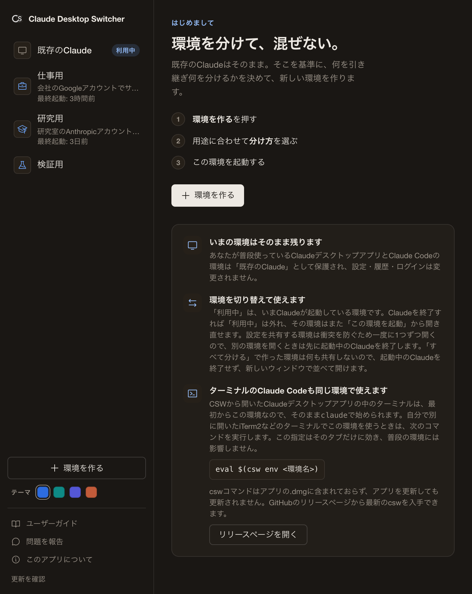
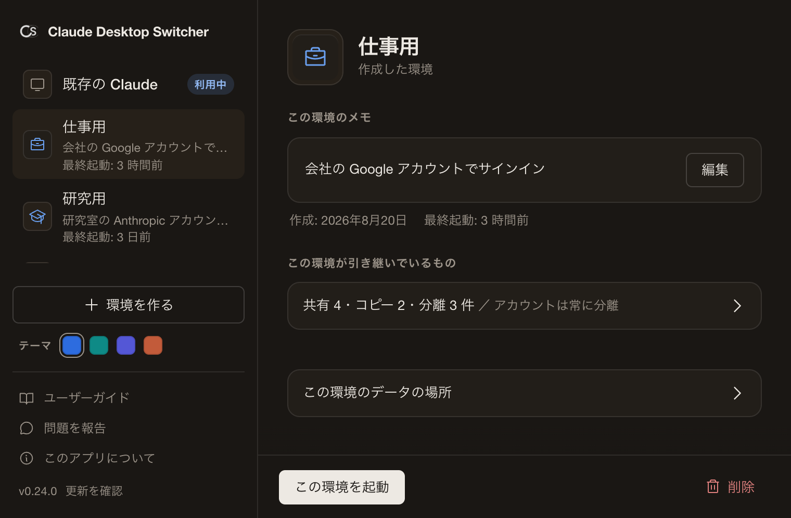
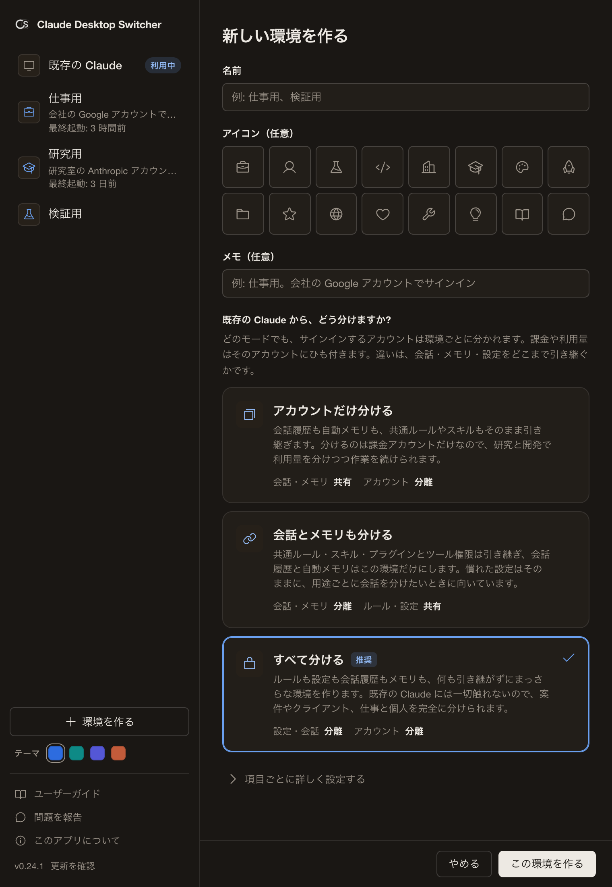

# Claude Desktop Switcher: ユーザーガイド

Claude Desktop Switcherは、ClaudeデスクトップアプリとClaude Code（CLI）の環境を、アカウント単位で安全に分離・管理するためのmacOSメニューバーユーティリティです。

### なぜこのツールが必要なのか、既存のワークアラウンドと何が違うのか
公式のClaudeデスクトップアプリには複数アカウントを切り替える機能がありません。これまでは、ターミナルから`--user-data-dir`を指定して別インスタンスを起動する方法や、`direnv`やエイリアスのようなCLI向けの切り替え手段が使われてきました。CLIのプロファイル切り替えは、こうしたCLI向けの手段がすでによく解決しています。
ただ、これらはそれぞれデスクトップとCLIの片方を受け持つ手段で、環境ごとの専用データディレクトリによるデスクトップアプリの分離と、CLI環境の連動を一度に行うものではありません。

本ツールを使うと、シェルスクリプトを書かずに、設定ウインドウから「**デスクトップアプリの分離**」をワンクリックで行えます。さらに、ターミナルからコマンドを実行すると、「**デスクトップアプリと連動したCLI環境の起動**」も行えます。システムの環境変数を一切破壊しない「ゼロ・インパクト原則」に基づいて設計されています。

---

## 0. 考え方：「既存のClaude」を基準に分ける

CSWはこの一点だけ理解すれば迷いません。

- **「既存のClaude」= あなたが普段使っているClaudeデスクトップアプリとClaude Codeの環境**。これが基準点で、CSWはここを一切変更しません。
- **新しい環境を作る = 「既存のClaude」から、何を引き継ぎ・何を分けるかを決めること。** 共有・分離・コピーの「相手」は常に「既存のClaude」です。
  - **共有**: 既存のClaudeと同じ実体を使います。変更は両方に反映されます
  - **分離**: この環境専用の新しい実体を持ちます。独立していて、最初は空です
  - **コピー**: 作成時に一度だけ写し、以後は独立します
- **同じアカウントを使い続けたいだけなら、新しい環境は不要です。** その場合は「既存のClaude」をそのまま使えばよく、CSWを起動する必要すらありません。CSWが活きるのは「**別アカウント／別案件の独立環境**」を作りたいときです。
- **どの環境もアカウントは分かれます。** 各環境はそれぞれのアカウントでサインインし、課金と利用量はそのアカウントにひも付きます。サインイン情報やデバイスの識別子、コネクタを含むデスクトップアプリの設定は、どのモードでも環境ごとに分かれます。環境ごとに変わるのは「会話履歴と自動メモリを引き継ぐか」「共通ルールやスキルなどの設定を引き継ぐか」です。

---

## 1. インストールと初期セットアップ

デフォルトの個人環境をはじめ、既存のClaude環境はそのまま維持されます。

### ステップ1: アプリケーションのインストール
1. GitHubの[Releasesページ](https://github.com/matsumotory/claude-desktop-switcher/releases/latest)から最新の`.dmg`ファイルをダウンロードします。
2. ダウンロードした`Claude-Desktop-Switcher.app`を、macOSの「アプリケーション」フォルダにドラッグ＆ドロップします。
3. アプリを起動すると設定ウインドウが開きます。あわせて画面右上のメニューバーにアイコンが表示されます。メニューバーが混み合っているとアイコンは隠れることがありますが、Dockアイコンからいつでも設定ウインドウを開けます。インストールに使ったディスクイメージがマウントされたままの場合は、設定ウインドウの上部に案内が表示されるので、「取り出す」を押すとそのまま取り出せます。
4. 初回起動時のみ、ようこそ画面の下に補足カードが表示されます。内容は、既存のClaudeが保護されること、環境を切り替えて使えること、ターミナルのClaude Codeも同じ環境で使えること、の3点です。一度表示すれば以後は出ません。

### ステップ2: 新しい環境の作成とカスタマイズ
仕事用や研究用の新しい独立環境を作成します。

**本アプリは、データが混ざる事故を防ぐため「すべてが分離される完全隔離」がデフォルト動作となっています。**

一方で、「個人で育てた共通ルールやスキル・プラグインをそのまま使い回しつつ、利用量だけは仕事用アカウントに計上したい」といった高度なユースケース向けに、柔軟なカスタマイズ機能を提供しています。

1. 起動時に自動で開く設定ウインドウを使います。閉じているときは、Dockアイコンか、メニューバーのアイコンの「**設定...**」から再表示できます。
2. 「**環境を作る**」ボタンをクリックします。
3. 環境の情報を入力します。
   * **名前**: 例: `Work`、`Research`
   * **アイコン（任意）**: 用意したアイコンから選びます
   * **メモ（任意）**: 用途や、サインインに使うアカウントを書いておけます。メモは環境の一覧に表示され、あとから詳細画面で編集できます。
4. **どう分けますか? 3つのモードから選びます**
   初見でも迷わないよう、基本は次の3択です。どのモードでもアカウントは分かれ、変わるのは「何を引き継ぐか」です。引き継ぐものが多い順に並んでいます。細かく変えたい場合だけ「**項目ごとに詳しく設定する**」を開きます。

   * **アカウントだけ分ける**: 会話履歴も自動メモリも引き継ぎ、分離するのはアカウントだけです。研究と開発で決済を分けつつ、ひとつながりの作業を続けたいときに選びます。
   * **会話とメモリも分ける**: 共通ルール・スキル・プラグインとツール権限は引き継ぎ、会話履歴と自動メモリはこの環境だけにします。用途で分けつつ、慣れた設定を使い回したいときに選びます。
   * **すべて分ける**: 既定でおすすめの選択です。何も引き継がず完全に独立します。既存のClaudeには一切触れません。案件やクライアントごと、仕事用と個人用など、混ざってはいけないときに選びます。

   「会話とメモリも分ける」と「アカウントだけ分ける」の違いは、会話履歴と自動メモリ（projects/）と入力履歴（history.jsonl）を引き継ぐかどうかです。

   > Claude Codeの設定を`CLAUDE_CONFIG_DIR`で別の場所へ移しているときなど、既存のClaudeが標準の場所に見つからない場合、引き継ぐモードでも見つからない側の設定は引き継がれません。デスクトップ・CLIの両方とも見つからないときは、引き継げる設定が無いため「すべて分ける」だけで作成できます。いずれの場合も作成画面に説明が表示されます。

   **＜ユースケースに合わせた選び方＞**
   * **ケースA: 完全に別のプロジェクトとして作業する場合**
     「**すべて分ける**」を選びます。個人用とは切り離された、まっさらな環境が構築されます。
   * **ケースB: 慣れた共通ルールやスキルを持ち込みつつ、会話とメモリは新しく始める場合**
     「**会話とメモリも分ける**」を選ぶと、共通ルール（CLAUDE.md）・ルールファイル（rules/）・スキル・プラグイン・ツール権限をそのまま引き継ぎつつ、会話履歴と自動メモリはこの環境だけになります。
   * **ケースC: 研究と開発で決済を分けつつ、作業はそのまま続けたい場合**
     「**アカウントだけ分ける**」を選ぶと、会話履歴も自動メモリも引き継ぎ、分離するのはアカウントだけです。

5. 「**この環境を作る**」を押して保存します。

> **既存の環境の複製**
> 設定ウインドウで環境を選び「**複製**」ボタンを押すと、その環境の設定とデータをそのまま写した新しい環境を作成できます。似た構成をゼロから作り直す手間を省けます。会話履歴と自動メモリ、共通ルール、ルールファイル、スキル、ツール権限、入力履歴、ワークツリー一覧のうち「分離」と「コピー」の項目は複製先に写し、「共有」の項目は既存のClaudeへの共有のまま引き継ぎます。プラグインは、導入の記録が元の環境の場所を指しているため元の環境からは写さず、共有モードどおりに既存のClaudeから用意し直します。分離のときは空で始まるので、複製先で入れ直してください。アカウントのサインイン情報（config.json）、コネクタとアプリ設定、端末ID、セッションの実行状態は常に環境ごとに分かれるため写しません。ただし、Claudeデスクトップアプリは、サインインの状態を環境のフォルダのCookieにも保存しています。複製ではこのCookieをそのまま写します。そのため、複製先のClaudeデスクトップアプリは、複製元と同じアカウントでサインインした状態で開きます。複製元と複製先は同じサインインの状態を持つので、どちらかでログアウトすると、もう一方もログアウトされます。別のアカウントで使う環境は、複製ではなく「環境を作る」から作ってください。一方、ターミナルで使うClaude Codeは、サインイン情報をmacOSのキーチェーンに環境ごとに保存します。キーチェーンは環境のフォルダの外にあるので、この情報は複製先に写りません。複製先のターミナルでClaude Codeを初めて使うときは、ログインし直してください。Claude Codeがキーチェーンへ書けずに環境のフォルダに`.credentials.json`を置いていた場合は、このファイルも写るので、複製先も同じサインインの状態を持ちます。

---

## 2. 日々の使い方

セットアップ完了後の、日常的な利用手順です。手作業での難しい設定などは一切不要です。

### シナリオA: 仕事用アカウント「Work」で作業を始める
1. これから開くのが設定を共有する環境で、別のClaudeデスクトップアプリが起動中の場合は、先にそれを終了します。共有を含む環境は、衝突を防ぐため一度に1つずつ開くからです。「すべて分ける」で作った環境なら、終了せずに新しいウィンドウで開けます。
2. 設定ウインドウで、作成した「Work」環境を選びます。設定ウインドウは、メニューバーのアイコンやDockアイコンからも開けます。一覧には各環境のメモと最終起動の時期が表示されるので、環境が増えても目的のものをすぐ見つけられます。
3. **「この環境を起動」を押すと、その環境専用のClaudeデスクトップアプリが立ち上がります。**
   このウインドウは、この環境専用のデータ領域で動きます。初回のみ、仕事用のアカウントでサインインしてください。このとき、CSWの画面にも同じ案内のカードが表示されます。

> **メモ: 環境の同時起動**
> 「会話とメモリも分ける」や「アカウントだけ分ける」で作った、設定を共有する環境は、設定の衝突を防ぐため一度に1つずつ開きます。個人用に戻すときは、起動中のClaudeを終了し、サイドバーの「既存のClaude」を選んで「既存のClaudeを起動」を押してください。既存のClaudeに戻して、そのまま開きます。一方、「すべて分ける」で作った環境は何も共有しないため、起動中のClaudeを終了せずに、詳細画面の「重複して起動」で同時に開けます。

### シナリオB: ターミナルでClaude Codeを使う
ターミナルには2種類あり、必要な操作が違います。いずれの場合も、その環境で初めてClaude Codeを使うときは、一度だけCLIのサインインが必要です。手順は後述の「初回だけ: Claude Codeのサインイン」にあります。

**1. CSWから開いたClaudeデスクトップアプリの内蔵ターミナル**
このアプリから環境を起動した場合、その中で開くターミナルは最初からその環境になっています。環境変数を切り替える追加のコマンドは不要で、そのまま`claude`と入力して作業を始められます。

**2. iTerm2や標準のTerminalなど、自分で別に開く外部ターミナル**
ご自身で新しく開いたターミナルは、普段の環境のままです。対象の環境を使うときは、連携コマンドを実行します。

このコマンドにはCLIツール`csw`が必要です。署名・公証済みの`csw`を[最新リリース](https://github.com/matsumotory/claude-desktop-switcher/releases/latest)からダウンロードし、実行権を付けて`PATH`の通った場所に置いてください。例: `chmod +x csw && mv csw /usr/local/bin/`。Rustの開発環境があれば、このリポジトリをcloneして、その中で`cargo install --path crates/cli`を実行しても導入できます。`csw`は`.dmg`には含まれていないため、アプリを更新しても`csw`は更新されません。入れている版は`csw --version`で確かめられます。デスクトップアプリだけで使う場合は、分離の検査が案内するリンクの修復を除いて不要です。

1. iTerm2や標準のTerminalなどのターミナルを開きます。
2. `eval $(csw env Work)`を実行します。`Work`の部分は対象の環境名に置き換えます。
3. そのタブの環境変数が対象の環境に切り替わります。この指定はそのタブだけに効き、普段の環境には影響しません。そのまま`claude`で作業を始めてください。

**初回だけ: Claude Codeのサインイン**
Claude Codeのサインインは、デスクトップアプリのサインインとは別に管理され、環境ごとに一度だけ必要です。上のどちらのターミナルでも、その環境でまだサインインしていない状態で`claude`を実行すると、自動でサインインを促されます。画面の案内に従い、サインイン方法の選択肢からサブスクリプションのClaudeアカウントを選んでください。API課金のアカウントとは別です。一度サインインすればその環境に保持されるため、次回以降や環境を切り替えたときに再サインインする必要はありません。内蔵ターミナルと、同じ環境に切り替えた外部ターミナルは、同じサインインを共有します。

### シナリオC: いつも通りの個人用の環境に戻る
* **デスクトップ**: 設定ウインドウか、メニューバーのアイコンから「既存のClaude」を選択するか、MacのSpotlight等から`Claude.app`を直接起動すれば、常にこれまで通りの個人用の環境が開きます。
* **CLI**: iTerm2など、ご自身で普通に開いたターミナルで`claude`と打てば、常に個人用の環境である既存のClaudeとして動作します。

---

## 3. 知っておくべき安心・安全の仕様

* **アプリを起動し忘れても安全です**
  Claude Desktop Switcherは、システムの環境変数を裏で勝手に書き換えることはありません。本アプリを使わずに普通にClaudeを起動した場合は、100%これまで通り、既存のClaudeとして動くため、環境が破壊されることはありません。
* **間違ったアカウントでの利用を防ぐ見分け方**
  ターミナルでどの環境を使っているか迷ったら、そのタブで`echo $CLAUDE_CONFIG_DIR`を実行します。表示されたパスが`.context-switcher-claude/profiles/<環境名>/cli-data`で終わればその環境です。何も表示されないか、`.claude`で終わるパスなら既存のClaudeです。`csw status`が表示するのは、設定ウインドウかメニューバーのアイコンから最後に起動した環境、または`csw switch`で最後に選んだ環境です。「重複して起動」で開いた環境では変わりません。そのタブの環境とは限りません。デスクトップアプリで複数の環境を並べて開いていて、どのウィンドウがどの環境か分からなくなったときは、CSWの一覧でその環境を選び「前面に表示」を押してください。その環境のClaudeが前面に出ます。macOSは同じアプリの複数ウィンドウをDockで1つのアイコンにまとめるため、Dockのアイコンでは見分けられません。CSWから名指しで前に出す形にしています。
* **アクセントカラーを選べます**
  サイドバー下部のスウォッチで、アクセントカラーをブルー・ティール・インディゴ・テラコッタの4色から選べます。既定はブルーです。選んだ色は保存され、次回も同じ配色で開きます。共有・分離・削除などの意味色は変わりません。
* **ヘルプとバージョン**
  サイドバー最下部から、「ユーザーガイド」「問題を報告」「このアプリについて」を開けます。問題の報告はGitHubのIssuesに届き、免責の内容は「このアプリについて」の画面にあります。現在のバージョンと、最新リリースを確かめる「更新を確認」も同じ場所にあります。外部リンクは既定のブラウザで開き、アプリ自体はインターネット通信を行いません。
* **何を読み書きするかを文書ですべて公開しています**
  このアプリが読む場所・書く場所・決して触れないものの一覧と、通信していないことをご自身のMacで確かめる手順を、[プライバシーと透明性](PRIVACY.md)にまとめています。宣言だけでなく、確かめ方まで含めて公開しています。
* **間違えて環境を消しても戻せます**
  環境の削除は、フォルダごとmacOSのゴミ箱へ移動するだけです。ゴミ箱を空にするまでは、サインイン状態や共有リンクも含めて何も失われていません。戻したいときは、ゴミ箱の中のフォルダを`~/.context-switcher-claude/profiles/`へ移動してください。CSWのウィンドウに戻ると、一覧にそのまま再表示されます。すぐに消したいときは、削除の確認で「完全に削除」を選びます。これはゴミ箱を経由せず、戻せません。
* **この環境のデータはどこに何があるかを見通せます**
  環境の詳細画面の「この環境のデータの場所」を開くと、データフォルダのパスに加えて、この環境が専有している容量と、フォルダごとの概算サイズ、項目ごとの内訳が表示されます。共有している項目はリンク先を、それ以外は概算サイズと最終更新を示します。表示のために読むのはファイル名とサイズ・最終更新の日時だけで、中身は開きません。各フォルダは「Finderで表示」でそのまま開けるので、バックアップのときも迷いません。
* **分離が保たれているかをいつでも点検できます**
  環境の詳細画面の「分離の検査」で「検査する」を押すと、共有と分離が設定どおりかを項目ごとに確認できます。検査はファイルの中身を読まず、何も書き換えません。ターミナルでは`csw doctor`で同じ検査ができます。`csw doctor --fix`は、共有元があるのにリンク先が想定と異なってしまった共有リンクを張り直し、共有元があるのに欠けている共有リンクを作ります。v0.24.2以降の`csw`は、共有元があり、共有リンクの位置に空のフォルダが残っているとき、そのフォルダも共有リンクに置き換えます。中身のあるフォルダとファイルには触れません。名前の似たClaude Code本体の`claude doctor`はインストールを診断する別のコマンドで、この検査とは関係ありません。

---

## 4. よくある質問

**Q. 「共有」「分離」は、何に対しての共有・分離ですか？**
常に、あなたが普段使っている既存のClaudeに対してです。既存のClaudeと同じものを使うことを共有、この環境専用に新しく持つことを分離と呼び、新しい環境の項目ごとにどちらかを選びます。

**Q. 「既存のClaude」とは何ですか？**
あなたが普段使っている既存のClaudeデスクトップアプリとClaude Codeの環境そのものです。CSWはこれを表示・基準にするだけで、設定・会話履歴・アカウントを変更したり削除したりしません。アプリ内では環境一覧の先頭に「既存のClaude」として並びます。

**Q. 同じアカウントを使うだけでも、新しい環境を作る必要がありますか？**
いいえ。同じアカウント・同じ環境を使い続けたいだけなら、新しい環境は不要です。いつもどおりClaudeを起動すれば「既存のClaude」がそのまま使われます。CSWが役立つのは、別アカウントや別案件のために独立した環境を増やしたいときです。

**Q. 新しい環境を作ると、既存のClaudeは壊れませんか？**
壊れません。新しい環境は専用ディレクトリに作られ、既存のClaudeとは物理的に分かれています。環境を削除しても、既存のClaudeには影響しません。

**Q. 切り替えるたびに再サインインが必要ですか？**
いいえ。Claudeデスクトップアプリのサインインは、その環境のフォルダの中に保持されます。Claude Codeのサインインは、macOSのキーチェーンに環境ごとに分けて保存されます。どちらも初回だけサインインすれば、以後は切り替えてもサインインは保たれます。「環境を作る」で作った環境では、作った直後にその環境で一度サインインします。複製で作った環境のClaudeデスクトップアプリは、複製元と同じアカウントでサインインした状態で開きます。

**Q. デスクトップアプリを切り替えると、ターミナルのClaude Codeも自動で揃いますか？**
CSWから開いたアプリの中のターミナルは、最初からそのアプリと同じ環境なので、コマンドは要りません。ご自身で別に開いたターミナルは普段の環境のままなので、対象の環境名を渡して`eval $(csw env Work)`を実行して明示的に揃えてください。この指定はそのタブだけに効き、普段の環境には影響しません。環境の設定ディレクトリは自動で揃いますが、その環境で初めてClaude Codeを使うときは、CLIのサインインが別途一度だけ必要です。詳しくは次のQを参照してください。

**Q. デスクトップアプリにサインインしていれば、ターミナルのClaude Codeもサインイン済みですか？**
いいえ。デスクトップアプリのサインインとClaude Codeのサインインは、別々に管理されます。各環境でターミナルから初めて`claude`を使うときに、その環境で一度だけCLIのサインインが必要です。サインイン方法は、サブスクリプションのアカウントを選びます。一度サインインすればその環境に保持され、以後は環境を切り替えても再サインインは不要です。内蔵ターミナルと、同じ環境に切り替えた外部ターミナルは、同じサインインを共有します。詳しくは「2. 日々の使い方」のシナリオBを参照してください。

**Q. 各環境でのClaudeの利用量をCSWで一覧できますか？**
現時点では対応していません。CSWはインターネット通信を行わず、パスワードやサインイン情報にも触れない設計です。Claudeの利用上限に対する正確な使用率を、デスクトップアプリの利用分まで含めてこの原則のまま取得する方法が今のところ無いため、機能としては提供していません。将来、安全に取得できる公式の手段が用意されれば、対応を検討します。各環境でのClaudeの利用量は、その環境でClaudeを開けば、Claude本体の画面で確認できます。

**Q. 「会話とメモリも分ける」を選ぶと、具体的に何を引き継ぎますか？**
共通ルール（CLAUDE.md）・ルールファイル（rules/）・スキル（skills/）・プラグイン（plugins/）・ツール権限とフック（settings.json）・ワークツリー一覧（git-worktrees.json）を、既存のClaudeから引き継ぎます。一方で、プロジェクトの会話・メモリ（projects/）と入力履歴（history.jsonl）は、この環境だけにします。アカウントのサインイン情報（config.json）・コネクタとアプリ設定（claude_desktop_config.json）・端末ID（ant-did）・セッションの実行状態（sessions/）は、常に環境ごとに分かれます。細かく変えたい場合は作成画面の「項目ごとに詳しく設定する」で個別に調整できます。

**Q. 「アカウントだけ分ける」を選ぶと、何が変わりますか？**
共通ルール・スキル・プラグイン・ツール権限に加えて、プロジェクトの会話・メモリ（projects/）と入力履歴（history.jsonl）も引き継ぎます。分離するのはアカウントだけです。課金とClaudeの利用量は、その環境でサインインしたアカウントにひも付きます。研究と開発で決済を分けつつ、ひとつながりの作業を続けたいときに向きます。なお、コネクタとアプリ設定・セッションの実行状態は、このモードでも環境ごとに分かれます。

**Q. `~/.claude/rules/`に分けて置いたルールファイルも引き継がれますか？**
はい。Claude Codeは`~/.claude/rules/`のルールファイルを、`~/.claude/CLAUDE.md`と同じくすべてのプロジェクトで読み込みます。CSWでは「ルールファイル」という項目として共通ルール（CLAUDE.md）と同じように扱い、「アカウントだけ分ける」と「会話とメモリも分ける」では`rules/`も共有します。作成画面の「項目ごとに詳しく設定する」にある「ルールファイル」の行で、個別に変えることもできます。

v0.24.0以前のCSWで作った環境には`rules/`の共有リンクがまだありません。環境の詳細画面の「分離の検査」で「共有のリンクがありません」と表示されたら、ターミナルで`csw doctor --fix`を実行するとリンクを作れます。`rules/`の共有リンクを作れるのはv0.24.1以降の`csw`です。`csw`はアプリとは別に配布しているので、アプリを更新しても`csw`は更新されません。v0.24.2より前の`csw`は、どれも`csw --version`で`csw 0.1.0`と表示し、版を見分けられません。そう表示されたら、最新リリースから`csw`を入れ直してから`csw doctor --fix`を実行してください。

環境を作ったときに`~/.claude/rules/`がまだ無かった場合は、環境フォルダに空の`cli-data/rules`フォルダが作られます。`~/.claude/rules/`が無いあいだ、検査はこの項目を「共有元がまだありません」と表示し、問題として扱いません。あとから`~/.claude/rules/`を作ると、検査は「共有のリンクの位置に実体のフォルダがあります」と表示します。v0.24.2より前のアプリでは、この表示は「共有のリンクが実体のファイルに置き換わっています」です。この状態でv0.24.2以降の`csw`から`csw doctor --fix`を実行すると、空のフォルダが共有リンクに置き換わります。v0.24.2より前の`csw`はこのフォルダを置き換えないので、最新リリースから`csw`を入れ直してから実行してください。

なお、デスクトップのCoworkセッションでは、Claude Codeはリンクになっている`~/.claude/CLAUDE.md`と`~/.claude/rules/`を読み込みません。これは共有モード全体に共通するClaude Code側の仕様です。

**Q. メモリと会話履歴は何が違いますか？**
メモリは、過去から要約・抽出された洞察で、人が書く共通ルール（CLAUDE.md）とルールファイル（rules/）、Claudeが書く自動メモリ（projects/<プロジェクト>/memory/）の2つがあります。会話履歴は生のやり取りの記録で、実体はprojects/<プロジェクト>/の.jsonlです。「アカウントだけ分ける」は会話履歴と自動メモリの両方を引き継ぎ、「会話とメモリも分ける」は会話履歴と自動メモリをこの環境だけにします。人が書く共通ルール（CLAUDE.md）とルールファイル（rules/）は、どちらのモードでも既存のClaudeと共有します。

**Q. コネクタ（MCP）やアプリ設定は引き継がれますか？**
いいえ。コネクタとアプリ設定（claude_desktop_config.json）は、どのモードでも環境ごとに分かれます。デスクトップアプリはアカウント認証や起動時の書き換えのため安全に共有できず、設定を引き継ぐ中心はClaude Code側の共通ルール・スキル・プラグイン・ツール権限です。

**Q. いま前面にあるClaudeがどの環境か確かめられますか？**
はい。メニューバーのアイコンから「**いまの環境を確認**」を押すと、前面にあるClaudeがどの環境かを判定し、設定ウインドウでその環境を選択して答えます。完全分離環境を並べて開いていて、見た目の同じウィンドウを取り違えたくないときに使えます。前面のアプリを調べるのはこの操作のときだけです。

**Q. Claude Desktopの更新のあと、環境から外れてしまうことはありますか？**
はい、起きることがあります。更新後の自動再起動はCSWを経由しないため、開き直されたClaudeは既存のClaudeのデータで動きます。見た目は同じウィンドウなので気づきにくいですが、CSWでは「利用中」の表示が既存のClaudeに移り、CSWが起動していれば設定ウインドウに案内が表示されます。元の環境で続けるには、Claudeを終了してから「この環境を起動」を押してください。

**Q. 更新のたびに、開いていた環境を全部手で開き直すのが面倒です。**
更新を適用するには、開いているClaudeを全部終了する必要があります。Claude側の更新の仕組みが、アプリを差し替える前にすべての終了を待つためです。そこで、前回すべて閉じたときに同時に開いていた環境をCSWが覚えておき、設定ウインドウのバナーから「開き直す」を1回押すだけでまとめて開き直せます。いま動いている環境は自動で除きます。共有を含む環境が別のClaudeと同時に開けないときは、その環境だけ、先に動いているClaudeを終了するよう案内します。自動では何も起動せず、あなたが押したときだけ開きます。

