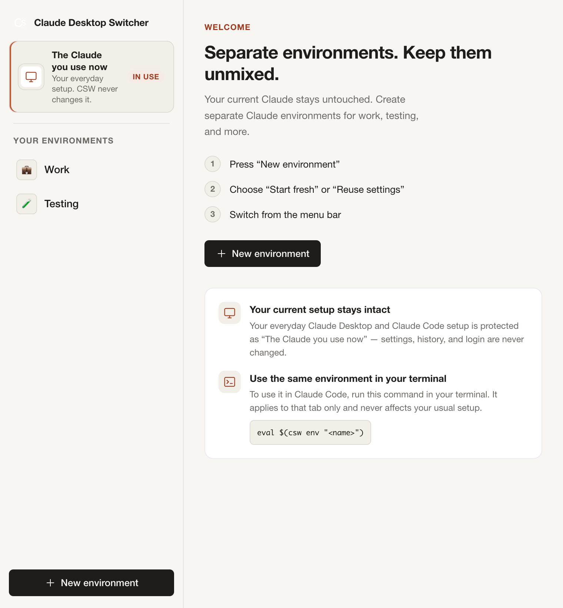
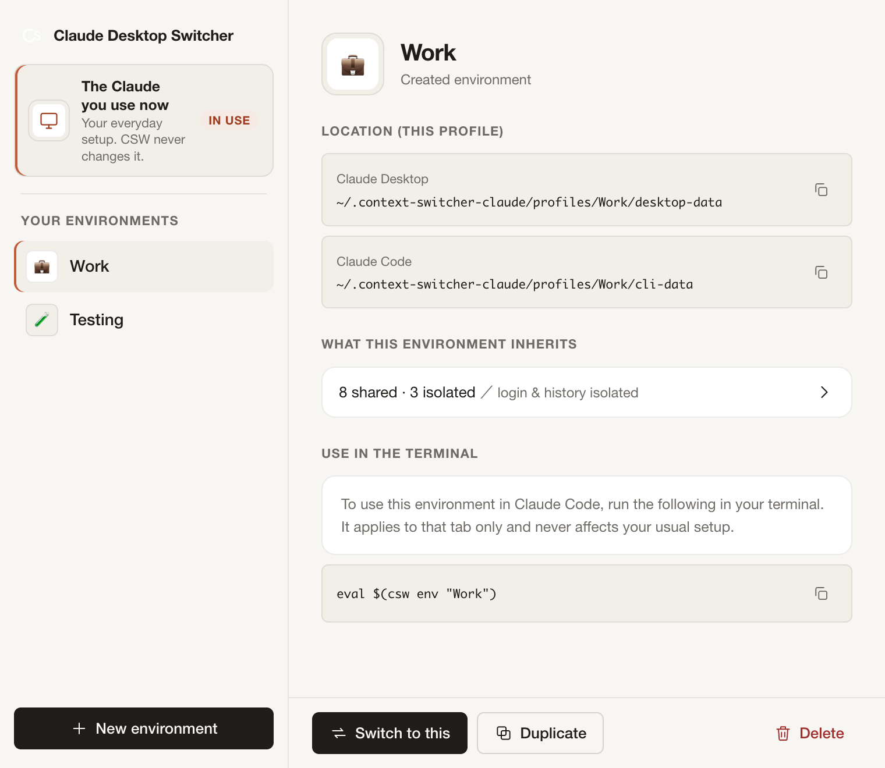
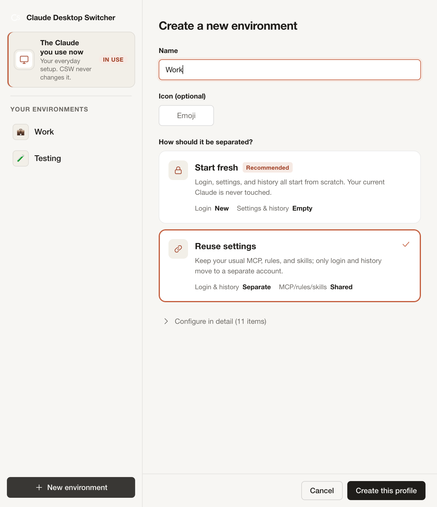

# Claude Desktop Switcher — User Guide

Claude Desktop Switcher is a macOS menu bar utility for safely isolating and managing account environments for the Claude Desktop App and Claude Code (CLI).

### Why do you need this tool?
The official Claude Desktop App lacks multi-account switching. To work around this, users have historically relied on messy hacks—like forcing separate instances via terminal `--user-data-dir` arguments or using CLI-only switchers like `direnv`. 
However, these methods fail to bridge the gap between "safe desktop app isolation (a dedicated data directory per profile)" and "CLI context syncing."

This tool eliminates the need for complex shell scripts. It achieves **"Desktop App Isolation"** with a single click from the menu bar, and allows **"Linked CLI Launching"** via simple terminal commands. It is based on a "Zero-Impact Principle" that never destroys or mutates your system's global environment variables.

---

## 1. Installation & Initial Setup

Your existing Claude environment (e.g., your default personal environment) is preserved as-is.

### Step 1: Install the Application
1. Download the latest `.dmg` file from the [Releases](https://github.com/matsumotory/claude-desktop-switcher/releases/latest) page.
2. Drag and drop the downloaded `ClaudeDesktopSwitcher.app` into your macOS `Applications` folder.
3. Launch the app. A blue icon will appear in your macOS menu bar.
4. On first launch only, the settings window shows a short 3-step onboarding tour (Welcome / How to use / Terminal integration). Once you read and close it, it will not appear again.

### Step 2: Create and Customize a New Profile
Create a new isolated environment for work or research.

**By default, this app operates in "Isolated" mode to strictly prevent accidental data mixing.**

For advanced use cases—such as "I want to share my personal MCP settings and rules, but route token usage to my Work account"—we provide flexible customization options.

1. Click the Claude Desktop Switcher icon in the menu bar and select **"Settings..."**.
2. In the settings window, click **"New environment"**.
3. Enter the profile information.
   * **Name**: (e.g., `Work`, `Research`)
   * **Icon (optional)**: an emoji or a single character
4. **Choose how it should be separated (pick one of two modes first)**
   To keep first-time use simple, there are just two choices. Open **"Configure in detail (11 items)"** only if you want to change individual components.

   * **Start fresh (recommended, default)**: Login, settings, and history all start from scratch. Your current Claude is never touched—you get a fully independent environment.
   * **Reuse settings**: Keep your usual MCP, rules, and skills; only login and history move to a separate account. Reuse your config assets while spending tokens on a different account.

   **< How to choose >**
   * **Case A (Completely separate project)**:
     Pick **"Start fresh"**. You get a pristine environment cleanly detached from your personal one.
   * **Case B (Switching accounts while keeping personal environment config)**:
     Pick **"Reuse settings"** to bring your familiar environment (MCP settings, CLAUDE.md rules) into the new profile.

5. Click **"Create this profile"** to save.

> **Duplicating an existing profile**
> Select a profile in the settings window and click the **複製 (Duplicate)** button to create a new profile that inherits its sharing configuration and layout. Login state follows each component's sharing mode—isolated components are not carried over, so you may need to sign in again in the new profile.

---

## 2. Daily Workflow

Here is the daily usage flow after setup. No manual configuration is required.

### Scenario A: Starting work with your Work account
1. Click the Claude Desktop Switcher icon in the menu bar.
2. Select the "Work" profile you created.
3. **A new Claude Desktop window will launch automatically.**
   （This window has a completely independent, dedicated data directory. Log in with your work account the first time you open it.）

> **Tip: You can run multiple apps simultaneously**
> Your original personal (Default) Claude window remains active. You can run your personal window alongside your work window to review code or multitask.

### Scenario B: Safely launching the Terminal (Claude Code)
This is the safest method to ensure your desktop app and terminal (CLI) accounts are perfectly synchronized.

1. Open your terminal (iTerm2, standard Terminal, etc.).
2. Run the sync command `eval $(csw env <Profile Name>)` (e.g., `eval $(csw env Work)`).
3. This safely switches your terminal's environment variables to the "Work" environment. Type `claude` to start working.
   （Tokens consumed or history generated in this terminal will never interfere with your personal environment.）

### Scenario C: Returning to your usual (Personal) environment
* **Desktop**: Select the "default" profile from the menu bar, or simply launch `Claude.app` normally via Spotlight. It will always open your standard personal environment.
* **CLI**: If you open a standard terminal and type `claude`, it will always operate as your default (personal) environment.

---

## 3. What You Should Know (Safety & Zero-Impact)

* **It's safe even if you forget to launch the app (Zero-Impact)**
  Claude Desktop Switcher never silently alters system environment variables. If you launch Claude normally without using this app, it will act as your default environment 100% of the time. Your existing setup cannot be broken.
* **How to prevent accidental token consumption**
  If you are unsure which account your terminal is using, simply run the `csw status` command. This will safely display the active profile currently applied to your terminal session.

